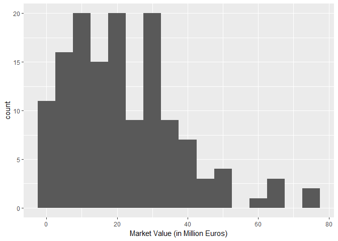
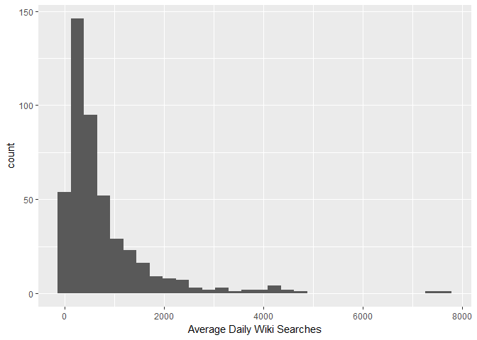
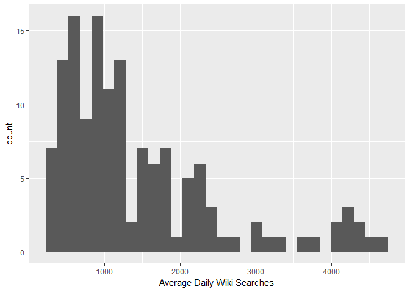

An Analysis of the English Premier League - Players and Teams 2016/2017
================

Exploring the Dataset
=====================

This dataset contains information for 461 players of the English Premier League, participating in 2016/17. This is still incomplete, as the transfer window is open. The data was scraped from TransferMrkt.com and Fantasy Premier League predominantly. To see the scraping, click [here](https://github.com/shubham-maurya/epl-data-scraping)

The head of the data looks like this -

``` r
knitr::kable(head(df))
```

| name              | club    |  age| position |  position\_cat|  market\_value|  page\_views|  fpl\_value| fpl\_sel |  fpl\_points|  region| nationality    |  new\_foreign|  age\_cat|  club\_id|  big\_club|
|:------------------|:--------|----:|:---------|--------------:|--------------:|------------:|-----------:|:---------|------------:|-------:|:---------------|-------------:|---------:|---------:|----------:|
| Alexis Sanchez    | Arsenal |   28| LW       |              1|             65|         4329|        12.0| 17.10%   |          264|       3| Chile          |             0|         4|         1|          1|
| Mesut Ozil        | Arsenal |   28| AM       |              1|             50|         4395|         9.5| 5.60%    |          167|       2| Germany        |             0|         4|         1|          1|
| Petr Cech         | Arsenal |   35| GK       |              4|              7|         1529|         5.5| 5.90%    |          134|       2| Czech Republic |             0|         6|         1|          1|
| Theo Walcott      | Arsenal |   28| RW       |              1|             20|         2393|         7.5| 1.50%    |          122|       1| England        |             0|         4|         1|          1|
| Laurent Koscielny | Arsenal |   31| CB       |              3|             22|          912|         6.0| 0.70%    |          121|       2| France         |             0|         4|         1|          1|
| Hector Bellerin   | Arsenal |   22| RB       |              3|             30|         1675|         6.0| 13.70%   |          119|       2| Spain          |             0|         2|         1|          1|

What I'm trying to build
========================

-   A regression model that explains a player's transfer value
-   Estimating the size of the EPL's impact on popularity of players who've been signed from abroad
-   Do a comparative analysis of the Top 6 vs other teams
-   Estimate the (inverse) English premium

But first, some nice and simple exploratory analysis.

How are Market Values Distributed?
==================================

One would expect the distribution to be long-tailed on the right : Lots of cheap players, with much fewer quality players.

 Clearly, the majority of players are valued under 10 million euros.

Top 6 (Yes, Tottenham too.)
===========================



Outside Top 6
=============


That gives us valuable information - the top 6 have a very different distribution as compared to the other clubs. (Okay, I'm going to clarify this right here - Top 6 is Manchester United, Tottenham, Manchester City, Arsenal, Chelsea, Liverpool) (in no particular order - okay fine. In the order I hope the 17/18 season finishes.)

Distribution of Popularity
==========================

I've also scraped the popularity of individual players. While this is no easy task given the lack of objectivity of what 'popular' means, I decided to go with a classic. Number of Wikipedia searches. While I admit this is not perfect, I think it suffers less than Twitter and Facebook data - several players don't have an account, they aren't active on social media, and so on. A count of news mentions was interesting, but I couldn't find the appropriate data.

Wikipedia searches, in my mind, seems a passable choice. It is not prone to influence by newspapers and player's pushing their profile (see Pogba). Some players just have more interesting stories than others, but on the whole, I think it's safe to assume that Wikipedia reflects a player's popularity.

Now regarding the daterange for the searches - this was a bit of a headache. THe data archive only dated back to 2015. Anyway, I definitely wanted to avoid May - August because of the transfer speculation. I settled on using *average daily searches* from August 1, 2016 to May 1, 2017, giving the summer transfer window a miss. It would have been ideal to ignore the winter window as well, but there was no way to do so easily. Since it's a relatively quiet window, I decided to allow that (minimal) bias.

Now let's lok at the histograms of popularity -

    ## `stat_bin()` using `bins = 30`. Pick better value with `binwidth`.



Top 6
=====

    ## `stat_bin()` using `bins = 30`. Pick better value with `binwidth`.



Outside Top 6
=============

    ## `stat_bin()` using `bins = 30`. Pick better value with `binwidth`.


Herein lies my motivation for this project. There seems to be some correlation between market value and popularity, atleast at a highly-aggregated level like this. I think it's worth diving deeper into the data, to see if a decent model can be built. That'll be the focus of the work.
